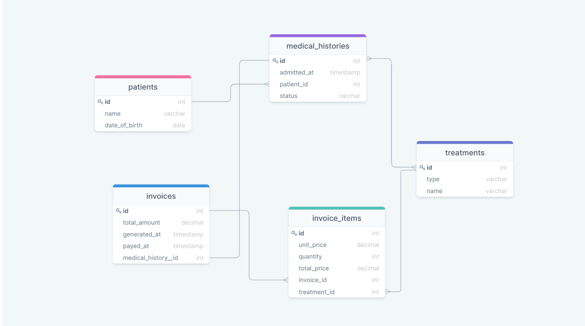

# Vet clinic database

> This project is a relational database to create the data structure for a clinic.

## Getting Started

This repository includes files with plain SQL that can be used to recreate a database:

- Use [schema.sql](./schema_based_on_diagram.sql) to create all tables.
- Use [data.sql](./data.sql) to populate tables with sample data.
- Check [queries.sql](./queries.sql) for examples of queries that can be run on a newly created database.

## Authors

👤 **Kanu Mike**

- GitHub: [@Ginohmk](https://github.com/Ginohmk)
- Twitter: [@michotall95](https://www.twitter.com/michotall95)
- LinkedIn: [@kanumike](https://www.linkedin.com/in/kanu-mike-497119211/)
- Instagram: [@savy_kanu_mike](https/instagram.com/savy_kanu_mike)
- Facebook: [@mike.kanu](https://www.facebook.com/mike.kanu)

👤 **JihaneH**

- GitHub: [@githubhandle](https://github.com/jihaneH)
- LinkedIn: [LinkedIn](https://www.linkedin.com/in/jihanne/)

## 🤝 Contributing

Contributions, issues, and feature requests are welcome!

Feel free to check the [issues page](../../issues/).

## Show your support

Give a ⭐️ if you like this project!

## 📝 License

This project is [MIT](./MIT.md) licensed.
